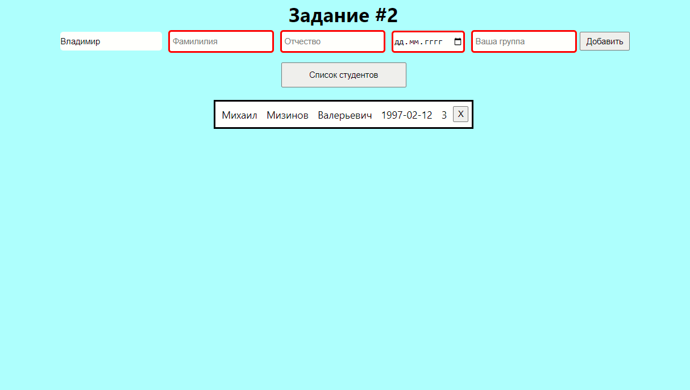
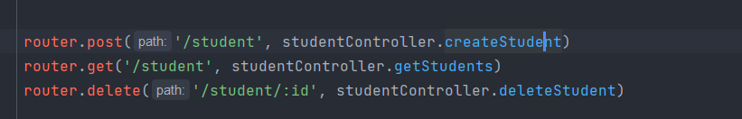
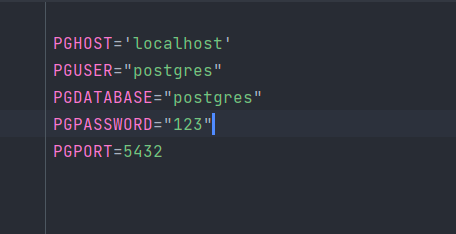

## Задание 1

    Задание сделал используя node js создал проверочную папку Root которую парсил, есть небольше описание в коде Для
    проверки задания сделайте клоне проекта, инициализируйте yarn, с установкой всех зависимостей Запуск программы
    осуществляеться в терминале командой yarn start

## Задание 2

### Процесс выполнения:

    Сделал серверную часть на express, ее запуск осуществляеться в консоли командой

### `yarn dev`

    БД использовал postgres. Перед началом необходимо иметь на компьютере postgres, далее в файле env 
    измение данные для входа в БД на свои

    После написал небольшое приложение на React, при клоне использовал пакет `yarn`
    Для проверки задание сделайте клон -> инициализируйте yarn -> далее находясь в главное папке запустите
    с одной консоли сервер в другой приложение, используя команды:

### `yarn dev`   запуск сервера

### `yarn start` запуск приложения в браузере

    Сами задания находяться в 2х ветках task1, task2. !Третье задание находиться в репозитории Todo 
